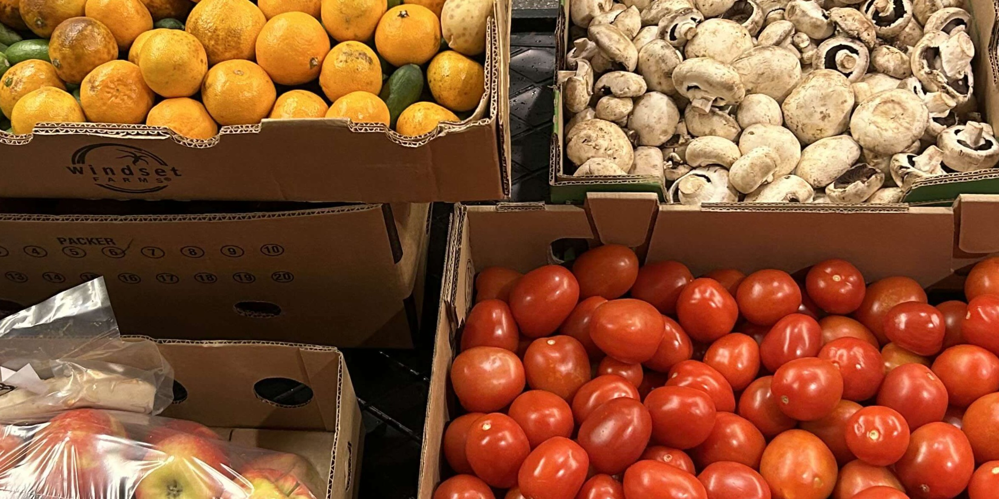

# Heading
## Second heading
### Third heading
#### Fourth heading
##### Fifth heading
###### Sixth heading

This is body text.

+ this is a list
+ of
+ words

1. this is
2. an ordered
3. list

```toml
this is a block of code
you can put words in here you can put words in here you can put words in here you can put words in here you can put words in here
```

.\
.\
.

**This is a line**
___

.\
.\
.

**This is a panelset**


  Donec sagittis purus interdum tellus interdum, vel placerat mi porttitor. Cras feugiat leo dui, a efficitur ipsum pretium eget. Cras ante ex, hendrerit quis augue sollicitudin, malesuada pellentesque ante.


  Mauris at urna ut risus tempor tempor non at enim. Aliquam justo eros, sagittis eu molestie quis, lobortis eu sapien. Nam commodo tempus ipsum, sit amet efficitur magna fermentum non. Sed lacinia, metus ut efficitur scelerisque, dui tortor eleifend lacus, in tincidunt metus leo id nunc. Sed ac turpis in augue tempor egestas.



<table class="collapse ba bw1 b--moon-gray mv4 w-100">
  <thead>
    <tr>
      <th class="f6 fw6 tl ttu pa3">This is a table example</th>
      <th class="f6 fw6 tl ttu pa3">Rating</th>
    </tr>
  </thead>
  <tbody>
    <tr class="stripe-dark">
      <td class="pa3">The Big Lebowski</td>
      <td class="pa3">&starf;&starf;&starf;&starf;&starf;</td>
    </tr>
    <tr class="stripe-dark">
      <td class="pa3">Pulp Fiction</td>
      <td class="pa3">&starf;&starf;&starf;&starf;&starf;</td>
    </tr>
    <tr class="stripe-dark">
      <td class="pa3">Fargo</td>
      <td class="pa3">&starf;&starf;&starf;&starf;&starf;</td>
    </tr>
    <tr class="stripe-dark">
      <td class="pa3">Intersellar</td>
      <td class="pa3">&starf;&starf;&starf;&starf;&star;</td>
    </tr>
    <tr class="stripe-dark">
      <td class="pa3">Dumb &amp; Dumber</td>
      <td class="pa3">&starf;&starf;&starf;&starf;&star;</td>
    </tr>
    <tr class="stripe-dark">
      <td class="pa3">The Big White</td>
      <td class="pa3">&starf;&starf;&starf;&starf;&star;</td>
    </tr>
  </tbody>
</table>

> **This is a quote** Lorem ipsum dolor sit amet, consectetur adipiscing elit. Duis mollis, est non commodo luctus, nisi erat porttitor ligula, eget lacinia odio sem nec elit. Donec ullamcorper nulla non metus auctor fringilla tortor mauris condimentum[^1] nibh.\
> *-- someone wise*




[^1]: This is a footnote at the bottom of the page.